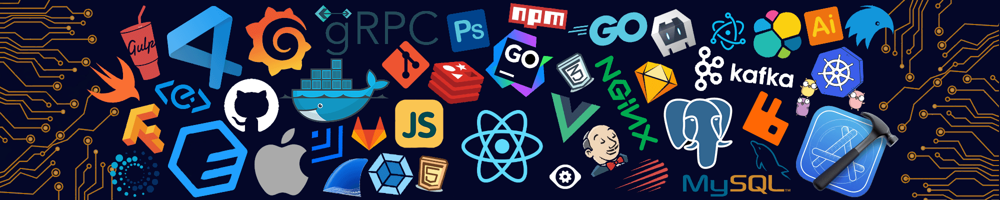

##  Hey there, My name is Azizbek  

###

### About me:

- 💻 I'm Software Engineer ( Front-End )
- ✨ I like to solve algorithmic tasks in Codewars
- 🔭 Hobbies: Following new techs on web development
- 🎓 Graduated from Inha University in Tashkent
- 🎓 Student of RSSchool (JavaScript Developer)
- 🎨 Portfolio website : <a href="https://a-samatov22.netlify.app/" target="_blank">sab.netlify.app</a> (under development)

###

  
  
  
  
   

####

 

  <h3 align="center">🛠 Tools & Technology</h3>

  
  
  
  
  
  
  
  
  
  
  
  
  
  
  
  

  <h3>:octocat: My github stats:</h3>

  
  
   

  <h4>:octocat: My github stats:</h4>

 

  
 
    Visitor Count
     
    
  

