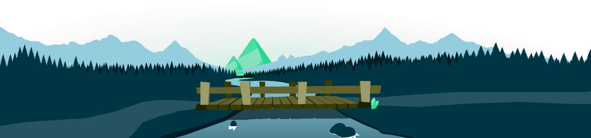

<h1>
  
  Hi there, my name is Azizbek 
  
</h1>

 

<!--  -->

### About me:

- 💻 I'm Software Engineer ( Front-End )
- ✨ I enjoy tackling algorithmic challenges on Codewars
- 🔭 Hobbies: AI, Mobile and Web Development
- 🎓 Graduated from Inha University in Tashkent
- 🎓 Student of RSSchool (JavaScript | NodeJS)
- 🎨 Portfolio website : <a href="https://a-samatov.netlify.app/" target="_blank">a-samatov.netlify.app</a> (under development)

  
  
  
  
   

   
  

  <h3 align="center">🛠 Tools & Technology</h3>

  
  
  
  
  
  
  
  
  
  
  
  
  
  
  
  

  <h3>:octocat: My github stats:</h3>

  
  
   

  <h3 align="center"> 
    Visitor Count
     
    
  </h3>

